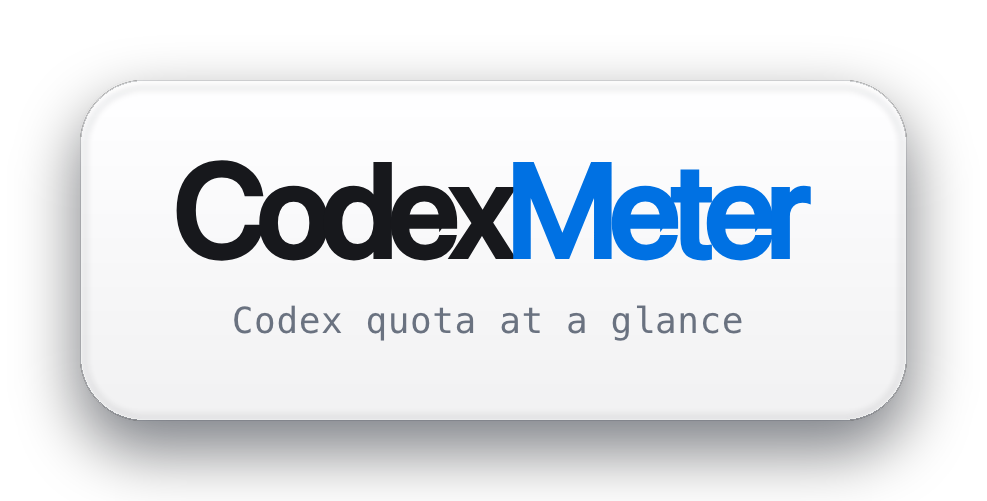
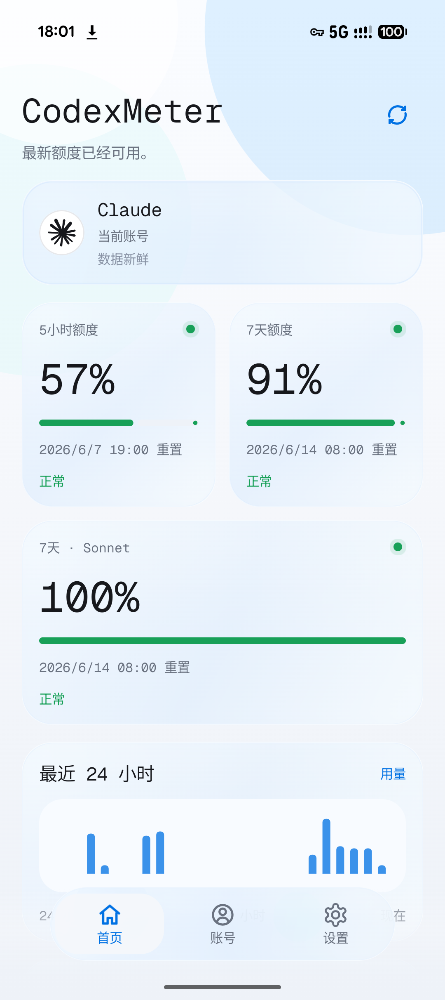
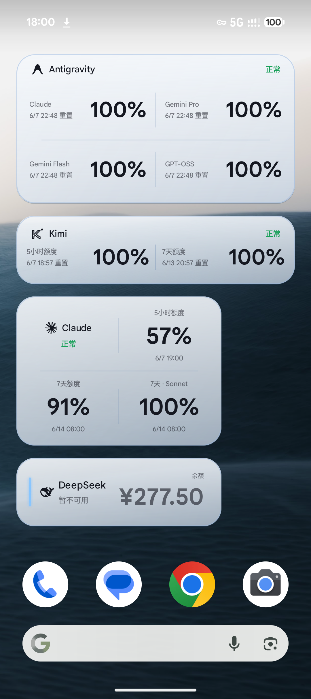
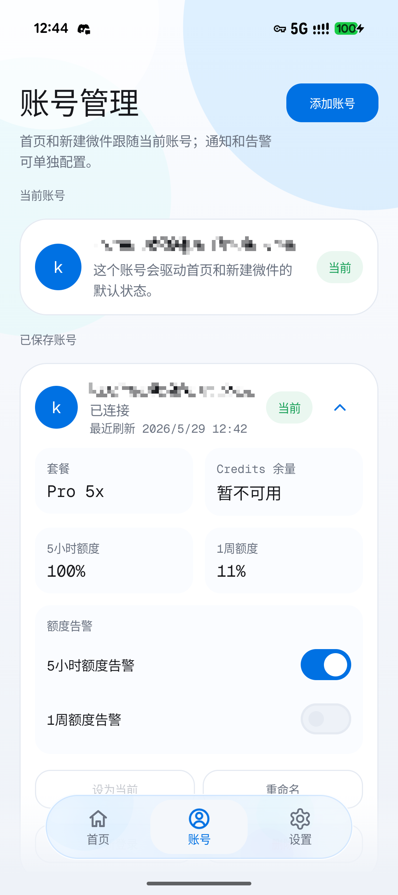
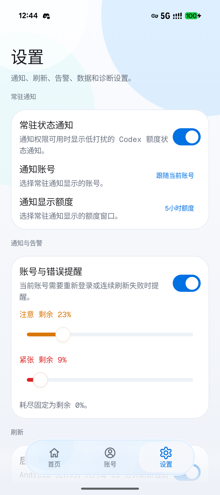

<p align="center">
  
</p>

<div align="center">

[English](README.md) | 简体中文

[](LICENSE) [](https://developer.android.com/about/versions/12) [](https://kotlinlang.org/) [](https://github.com/KyoMio/CodexMeter/releases)

</div>

> 一个轻量的 AI 订阅配额 Android 看板。

CodexMeter 是一个非官方 Android 应用，用来在应用首页、桌面小组件和低打扰常驻通知里查看 Codex 及其它 AI 服务商的官方配额使用情况。

## 截图

| 首页 | 小组件 | 账号 | 设置 |
| --- | --- | --- | --- |
|  |  |  |  |

## 功能特性

- 仅使用官方 usage / quota / balance API 数据。
- 额度窗口支持百分比 / 余额 / 次数 / 多模型分桶等展示。
- 余额型供应商自动按目标货币换算（保留原始货币）。
- 首页仪表盘提供供应商自适应的小时级使用趋势图。
- 可调整大小的 Jetpack Glance 桌面小组件。
- 常驻状态通知带供应商与账号标识，并支持按账号配额提醒。
- 「需要重新登录」检测并弹出通知。
- 支持保存多个账号并选择一个当前账号，可按账号开关配额提醒。
- 本地历史记录保留与清理。

## 支持供应商

| 供应商 | 登录方式 |
| --- | --- |
| Codex | device-code 授权（外部浏览器） |
| Claude | OAuth 登录（应用内 WebView） |
| Antigravity | Google OAuth 登录（应用内 WebView） |
| DeepSeek | API Key |
| z.ai | API Key |
| MiniMax | API Key |
| Cursor | Cookie 采集（应用内 WebView） |
| Kimi | Cookie 采集（应用内 WebView） |

## 隐私与安全

CodexMeter 会把敏感数据保存在设备本地。

- OAuth 会话使用 Android Keystore 支持的 AES-GCM 加密保存。
- raw token、Cookie、授权码、完整回调 query、原始 usage 响应和完整 `auth.json` 内容都不应被日志、界面、截图或仓库记录泄露。
- 不包含云同步、分析 SDK、远程日志、广告 SDK 或第三方配额代理。

## 技术栈

- Kotlin
- Jetpack Compose + Material 3
- StateFlow + ViewModel
- Room
- DataStore
- WorkManager
- Jetpack Glance
- OkHttp + kotlinx.serialization
- Android Keystore + AES-GCM
- 手写 `AppContainer`

## 快速开始

环境要求：

- 安装 Android SDK 的 Android Studio
- JDK 17
- Android 12+ 设备或模拟器

构建 debug APK：

```bash
./gradlew assembleDebug
```

运行单元测试：

```bash
./gradlew test
./gradlew :app:testDebugUnitTest
```

使用 adb 安装 debug APK：

```bash
adb install -r app/build/outputs/apk/debug/app-debug.apk
```

## 项目文档

- [产品需求](docs/PRD.md)
- [架构说明](docs/ARCHITECTURE.md)
- [实现规格](docs/SPEC.md)
- [设计系统](DESIGN.md)
- [开发规则](RULES.md)

## 致谢

部分供应商的用量 / 配额响应数据解析参考了 [steipete/CodexBar](https://github.com/steipete/CodexBar) 项目。

## 许可证

MIT License。详见 [LICENSE](LICENSE)。

## 免责声明

CodexMeter 是非官方项目，与 OpenAI 无关联。请使用你自己的账号，并遵守相关服务条款。
